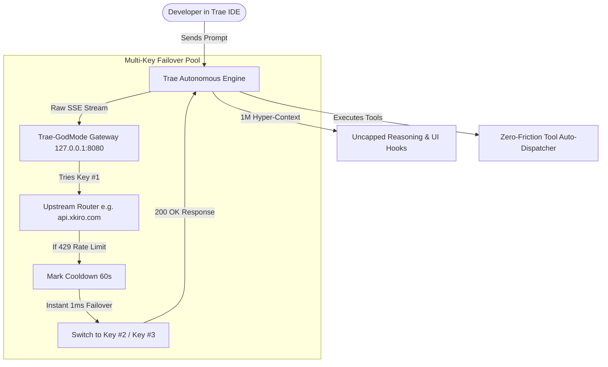

# 🏛️ Trae-GodMode Architecture & Internal Specifications

Trae-GodMode operates across two distinct performance layers:
1. **The In-Memory UI & Runtime Patcher (`core/patcher.py`)**
2. **The Zero-Latency Multi-Key Failover Gateway (`core/gateway.py`)**

---

## 📐 End-to-End Execution Flow

---

## 🧠 Subsystems Explained:

### 1. Fallback Reasoning Injector (Module 70489)
* Trae server syncs `reasoning_effort_options: null` by default.
* Our patch intercepts the getter `s(e)` and injects fallback `["none", "low", "medium", "high", "xhigh", "max"]`.
* Sets default reasoning depth `i` to `"max"` for uncapped Chain-of-Thought (CoT) reasoning.

### 2. Autonomous Action Approval Hooks
* Hooked into React component `t_` (Commands), `ty` (MCP Tools), `tv` (File Deletions), and `tS` (Multi-Step Plan Continues).
* Injects `useEffect(() => { confirmAction(); }, [])` so that all actions are autonomously approved in 0ms without modal prompts.

### 3. Hyper-Context (1M Token) Unlocker
* Intercepts `maxModeSwitch` and permits any model with `context_window_size.max > 200000` to toggle between standard (200k) and hyper-context (1,000,000 tokens).
